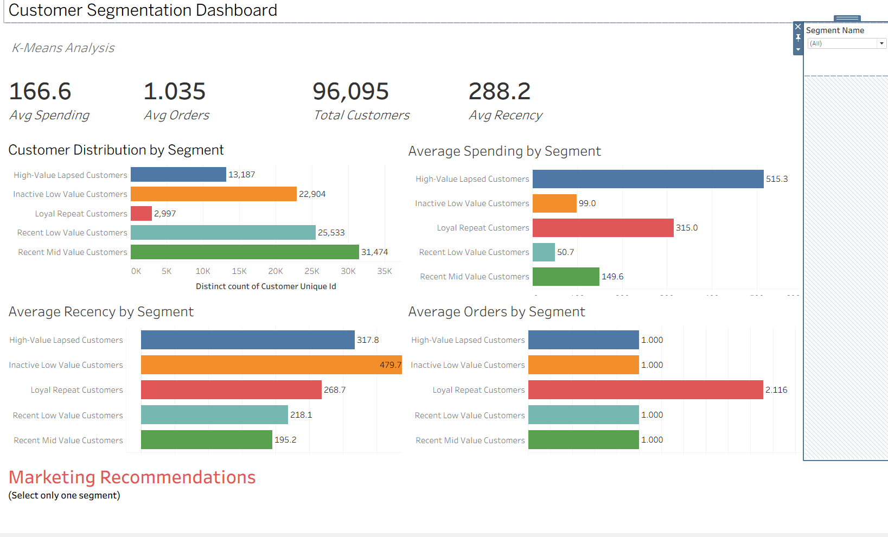
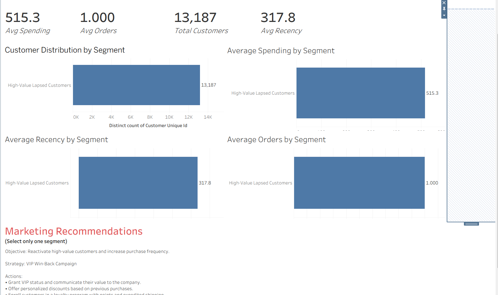
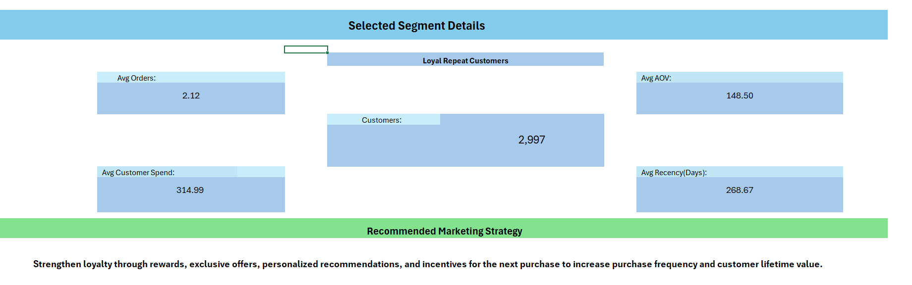

# Customer Segmentation Using K-Means

## Customer Behavior Analysis & Data-Driven Marketing Strategy

An end-to-end customer segmentation project that applies **K-Means clustering** to e-commerce transactional data to identify meaningful customer groups and develop targeted marketing strategies.

The project covers the complete workflow from **SQL data exploration and feature engineering** to **machine learning, customer profiling, marketing recommendations, and business intelligence dashboards using Tableau and Excel**.

---

## Project Overview

E-commerce businesses often have thousands of customers with significantly different purchasing behaviors.

Treating all customers with the same marketing strategy can lead to inefficient marketing spending and poor customer engagement.

The purpose of this project is to transform transactional customer data into meaningful behavioral segments that can support more targeted marketing decisions.

Customer behavior is analyzed using four primary features:

- Total Spending
- Total Orders
- Average Order Value
- Recency

K-Means clustering is then used to group customers with similar purchasing behavior.

The resulting clusters are translated into interpretable customer segments and actionable marketing strategies.

---

## Project Objectives

The main objectives of this project are to:

- Analyze customer purchasing behavior from transactional data.
- Explore the underlying e-commerce database using SQL.
- Engineer customer-level behavioral features.
- Perform exploratory data analysis.
- Standardize features before clustering.
- Implement K-Means clustering from scratch to understand the algorithm.
- Determine an appropriate number of clusters using the Elbow Method.
- Train the final K-Means model using Scikit-learn.
- Profile and interpret the resulting customer clusters.
- Translate clusters into meaningful marketing segments.
- Develop targeted marketing recommendations for each segment.
- Build interactive Tableau and Excel dashboards for business stakeholders.

---

## Dataset

The project uses an e-commerce transactional database containing information related to:

- Customers
- Orders
- Order Items
- Payments
- Geographical information

The original transactional tables were explored using SQL before being transformed into a customer-level dataset suitable for machine learning.

Each final observation represents an individual customer rather than an individual transaction.

---

## SQL Data Exploration

SQL was used to inspect the structure of the transactional database and understand the relationships between the available tables.

The SQL stage included:

- Inspecting database tables
- Examining table schemas
- Identifying customer identifiers
- Exploring order information
- Exploring payment information
- Joining relevant tables
- Aggregating transactions at customer level
- Extracting features required for customer segmentation

This stage transformed raw transactional records into information suitable for behavioral analysis.

---

## Feature Engineering

Customer-level behavioral features were created from the transactional data.

### Total Spending

Total monetary value generated by a customer.

```text
Total Spending = Sum of customer transaction values
```

### Total Orders

Number of orders associated with each customer.

```text
Total Orders = Number of customer orders
```

### Average Order Value

Average amount spent per order.

```text
Average Order Value = Total Spending / Total Orders
```

### Recency

Number of days since the customer's most recent purchase relative to the reference date used in the analysis.

Lower recency values represent more recent customers, while larger values indicate customers who have been inactive for longer periods.

These features provide information about:

- Customer value
- Purchase frequency
- Typical transaction size
- Customer activity

---

## Exploratory Data Analysis

Before applying machine learning, exploratory data analysis was performed to understand the distributions and behavior of the engineered customer features.

The analysis examined:

- Customer spending distributions
- Order frequency
- Average order value
- Customer recency
- Potential outliers
- Differences in customer purchasing behavior

This step helped verify the engineered features before clustering.

---

## Feature Standardization

The clustering features have different numerical scales.

For example, total spending can contain substantially larger numerical values than total orders.

Using the original values directly could cause features with larger scales to have a disproportionate influence on distance calculations.

Therefore, the features were standardized using Scikit-learn's `StandardScaler`.

The standardization formula is:

```text
z = (x - μ) / σ
```

Where:

- `x` = original value
- `μ` = feature mean
- `σ` = feature standard deviation
- `z` = standardized value

After standardization, features are centered around approximately zero with a standard deviation of approximately one.

The standardized feature matrix was used for K-Means training, while the original unscaled values were retained for business interpretation.

---

## K-Means Clustering Methodology

K-Means is an **unsupervised machine learning algorithm** that divides observations into groups based on similarity.

The algorithm attempts to minimize the distance between observations and their assigned cluster centroid.

The objective can be represented as:

```text
J = Σ ||xᵢ - μₖ||²
```

Where:

- `xᵢ` represents a customer
- `μₖ` represents the centroid of the assigned cluster
- `J` represents the within-cluster sum of squared distances

The basic K-Means process is:

1. Select the number of clusters `K`.
2. Initialize K centroids.
3. Calculate the distance between each customer and each centroid.
4. Assign every customer to the nearest centroid.
5. Recalculate the centroids.
6. Repeat assignment and centroid updates until convergence.

---

## K-Means From Scratch

Before using Scikit-learn, K-Means was implemented from scratch to understand the underlying algorithm.

The implementation included:

- Centroid initialization
- Distance calculations
- Customer-to-cluster assignment
- Centroid recalculation
- Iterative optimization
- Convergence checking

This implementation demonstrates the mathematical logic behind K-Means rather than treating the algorithm as a black box.

---

## Selecting the Number of Clusters

The **Elbow Method** was used to evaluate different values of `K`.

Multiple K-Means models were trained using different numbers of clusters, and their inertia values were compared.

Inertia measures the total squared distance between observations and their assigned cluster centroids.

The goal is to identify a point where increasing the number of clusters provides diminishing improvements.

Based on the analysis, the final model used:

```text
K = 5
```

This produced five interpretable customer segments.

---

## Final Customer Segments

The final K-Means model identified five customer groups.

### 1. High-Value Lapsed Customers

**Characteristics**

- Highest average spending
- Approximately one order per customer
- Relatively high recency
- Strong purchasing power but limited repeat purchasing

**Business Interpretation**

These customers have demonstrated substantial monetary value but have not developed a strong repeat-purchase relationship with the business.

**Strategy: VIP Win-Back Campaign**

Actions:

- Grant VIP status and communicate their value to the company.
- Provide personalized offers based on previous purchases.
- Enroll customers in a loyalty program.
- Offer benefits such as points and expedited shipping.
- Conduct an A/B test comparing a promotional offer with an incentivized feedback survey.

**Primary KPIs**

- Reactivation Rate
- Repeat Purchase Rate
- Customer Lifetime Value

---

### 2. Inactive Low-Value Customers

**Characteristics**

- Low average spending
- Approximately one order
- Highest recency among the customer segments
- Long period of inactivity

**Business Interpretation**

These customers made a low-value purchase and have not returned for a significant period.

**Strategy: Low-Cost Reactivation Campaign**

Actions:

- Use inexpensive email or push-notification campaigns.
- Provide limited-time comeback offers.
- Recommend products related to previous purchases.
- Avoid expensive acquisition or retention incentives for this group.
- Test whether the segment can be profitably reactivated before increasing marketing investment.

**Primary KPIs**

- Reactivation Rate
- Campaign Conversion Rate
- Cost per Reactivated Customer

---

### 3. Loyal Repeat Customers

**Characteristics**

- Highest average order frequency
- Approximately 2.116 orders per customer
- Strong average spending
- Demonstrated repeat-purchase behavior

**Business Interpretation**

This is the strongest repeat-purchase segment and represents an important group for customer retention and long-term value.

**Strategy: Loyalty and Value Expansion**

Actions:

- Strengthen loyalty program benefits.
- Provide personalized product recommendations.
- Use cross-selling and upselling opportunities.
- Provide early access to selected offers or products.
- Encourage referrals and advocacy.
- Protect this group from churn through retention campaigns.

**Primary KPIs**

- Repeat Purchase Rate
- Purchase Frequency
- Average Order Value
- Customer Lifetime Value
- Retention Rate

---

### 4. Recent Low-Value Customers

**Characteristics**

- Lowest average spending
- Approximately one order
- Relatively recent purchasing activity
- New opportunity for developing a second purchase

**Business Interpretation**

These customers have purchased recently but currently generate limited monetary value.

Because the relationship is still recent, they represent an opportunity for early lifecycle marketing.

**Strategy: Second-Purchase Conversion**

Actions:

- Send follow-up messages after the first purchase.
- Recommend related low-cost products.
- Provide a small incentive for the second purchase.
- Use product bundles to increase basket size.
- Personalize recommendations based on the initial transaction.

**Primary KPIs**

- Second Purchase Rate
- Conversion Rate
- Average Order Value
- Time to Second Purchase

---

### 5. Recent Mid-Value Customers

**Characteristics**

- Largest customer segment
- Moderate average spending
- Approximately one order
- Lowest recency among the major one-purchase groups
- Relatively recent relationship with the business

**Business Interpretation**

These customers represent a major opportunity because they purchased recently and already demonstrate moderate purchasing value.

The primary objective is to convert them from one-time customers into repeat customers.

**Strategy: Repeat-Purchase Development**

Actions:

- Launch post-purchase engagement campaigns.
- Provide personalized recommendations.
- Offer incentives for a second purchase.
- Introduce loyalty-program benefits.
- Use cross-selling based on previous product categories.
- Test different timing windows for second-purchase campaigns.

**Primary KPIs**

- Second Purchase Rate
- Repeat Purchase Rate
- Conversion Rate
- Average Order Value
- Customer Lifetime Value

---

## Key Results

The final analysis produced the following overall results:

| Metric | Result |
|---|---:|
| Customers Analyzed | 96,095 |
| Customer Segments | 5 |
| Overall Average Spending | 166.6 |
| Average Orders per Customer | 1.035 |
| Overall Average Recency | 288.2 days |

Notable segment-level findings include:

- **High-Value Lapsed Customers** recorded the highest average spending at approximately **515.3**.
- **Loyal Repeat Customers** recorded the highest average order frequency at approximately **2.116 orders per customer**.
- **Inactive Low-Value Customers** had the highest average recency at approximately **479.7 days**.
- **Recent Mid-Value Customers** formed the largest segment with approximately **31,474 customers**.

---

## Marketing Strategy

The purpose of customer segmentation is not simply to create clusters.

The clusters must support business decisions.

The final marketing framework therefore focuses on different objectives for different customer behaviors:

| Segment | Primary Objective |
|---|---|
| High-Value Lapsed Customers | Reactivate valuable customers |
| Inactive Low-Value Customers | Test cost-efficient reactivation |
| Loyal Repeat Customers | Retain and increase customer value |
| Recent Low-Value Customers | Generate a second purchase |
| Recent Mid-Value Customers | Convert recent buyers into repeat customers |

This allows marketing resources to be allocated according to customer behavior rather than applying the same campaign to every customer.

---

## Dashboard & Visualizations

### Tableau Customer Segmentation Dashboard

An interactive Tableau dashboard was developed to allow business stakeholders to explore customer segments, behavioral KPIs, and segment-specific marketing recommendations.

The dashboard includes:

- Total Customers
- Average Spending
- Average Orders
- Average Recency
- Customer Distribution by Segment
- Average Spending by Segment
- Average Orders by Segment
- Average Recency by Segment
- Dynamic Segment Filtering
- Segment-Specific Marketing Recommendations





### Excel Customer Segmentation Dashboard

An additional Excel dashboard was developed to provide a familiar business reporting interface for exploring customer segmentation results.

The Excel dashboard provides:

- Total Customers
- Average Spending
- Average Orders
- Average Recency
- Customer Distribution by Segment
- Segment-level behavioral comparisons



---

## Technologies & Tools

- **Python** — Data processing, feature engineering, analysis, and machine learning
- **Pandas** — Data manipulation and customer-level aggregation
- **NumPy** — Numerical computation and K-Means implementation
- **Scikit-learn** — Feature standardization and final K-Means model
- **Matplotlib** — Exploratory data visualization
- **SQL / SQLite** — Transactional data exploration and extraction
- **Jupyter Notebook** — Data analysis and model development
- **Tableau** — Interactive business intelligence dashboard
- **Microsoft Excel** — Business dashboard and reporting
- **Git & GitHub** — Version control and project documentation

---

## Project Workflow

```text
E-Commerce Database
        |
        v
SQL Exploration
        |
        v
Data Extraction
        |
        v
Feature Engineering
        |
        v
Exploratory Data Analysis
        |
        v
Feature Standardization
        |
        v
K-Means From Scratch
        |
        v
Elbow Method
        |
        v
Final K-Means Model
        |
        v
Cluster Profiling
        |
        v
Customer Segment Interpretation
        |
        v
Marketing Recommendations
        |
        +------------------+
        |                  |
        v                  v
Tableau Dashboard     Excel Dashboard
```

---

## Project Structure

```text
CustomerSegment/
│
├── data/
│   └── Project datasets and processed customer data
│
├── notebooks/
│   ├── Data preparation and exploration
│   ├── Feature engineering
│   ├── Exploratory data analysis
│   ├── K-Means from scratch
│   ├── K-Means with Scikit-learn
│   └── Cluster analysis
│
├── excel/
│   └── Excel customer segmentation dashboard
│
├── tableau/
│   └── Tableau customer segmentation dashboard
│
├── report/
│   ├── final_report.pdf
│   └── images/
│       ├── tableau_dashboard.png
│       ├── tableau_segment_filter.png
│       └── excel_dashboard.png
│
├── PROJECT_PLAN.md
├── requirements.txt
├── .gitignore
└── README.md
```

---

## Business Value

This project demonstrates how unsupervised machine learning can be connected directly to marketing decision-making.

Rather than stopping at model development, the project converts customer clusters into actionable strategies that can help businesses:

- Improve customer retention
- Increase repeat purchases
- Personalize marketing campaigns
- Prioritize high-value customers
- Reduce inefficient marketing spending
- Identify customer reactivation opportunities
- Increase customer lifetime value
- Support data-driven marketing decisions

---

## Future Improvements

Several extensions could improve the project further:

- Incorporate product-category behavior into customer segmentation.
- Add additional RFM-style behavioral features.
- Evaluate cluster quality using metrics such as the Silhouette Score.
- Compare K-Means with alternative clustering algorithms.
- Track customer movement between segments over time.
- Build automated customer-segmentation pipelines.
- Connect segmentation results to campaign performance data.
- Measure actual campaign uplift using controlled experiments.
- Estimate Customer Lifetime Value for each customer.
- Deploy segment predictions through an API or business application.

---

## Final Report

A detailed project report containing the methodology, machine learning process, customer segment interpretation, results, and marketing recommendations is available here:

[View Final Project Report](report/final_report.pdf)

---

## Conclusion

This project demonstrates a complete customer segmentation workflow that connects **data analysis, machine learning, marketing analytics, and business intelligence**.

Transactional e-commerce data was transformed into customer-level behavioral features and standardized before applying K-Means clustering. Five customer segments were identified and interpreted according to spending, purchase frequency, average order value, and recency.

The resulting clusters were then translated into targeted marketing strategies designed around customer reactivation, retention, repeat purchasing, loyalty, and value growth.

Finally, Tableau and Excel dashboards were developed to make the segmentation results accessible to business stakeholders.

The project demonstrates that machine learning becomes most valuable when model outputs are converted into **clear and actionable business decisions**.

---

## Author

**Ziad Ahmed Ibrahim**

Marketing graduate focused on **Data Science, Machine Learning, and Marketing Analytics**.